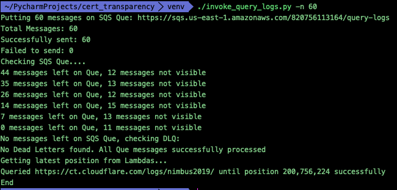
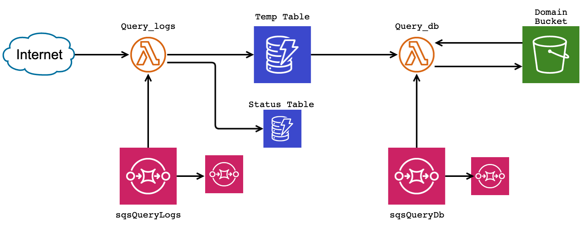

# Chlorine-40
Radioactive Certificate Grabber

# What is Chlorine-40

Inspired by [Axeman](https://github.com/CaliDog/Axeman) Chroline-40 is a serverless application for parsing through certificate logs. It uses the inherent parallel-lism of lambda functions to query cert logs and parse them in memory before storing results on disk. This eleminates the need for storing the entire cert in storage for parsing, and hence reduces the cost.

Obviously, it also means every new query has to be done from scratch.

# Installation

## Pre-requisites
* Python3
* [Terraform](https://www.terraform.io/)
* [Serverless Framework](https://serverless.com/)

I use Terraform to deploy the infrastructure (DynamoDB, S3 Buckets, SQS etc) and Serverless Framework to deploy the lambda functions.

Change the bucket name to avoid conflicts.

# To run

To query the cert logs into DynamoDB

    $ client/invoke_query_logs -l https://ct.cloudflare.com/logs/nimbus2019/

To store all data from DynamoDB into files on S3

    $ client/invoke_query_db 
    
By default, the script queries just 1.28 Million certs and parses out all the domains from the certs. 

It then stores those domains into a temporary DynamoDB table, which will then be finally stored in files on an S3 bucket. 

The files are sorted by the first two characters of the domain.

# Speed

In general, 10 parallel lambdas will take 10 minutes to query 25 Million certs, storing their results in a DynamoDB table.

It takes an additional 5 minutes to transfer data from DynamoDB onto S3 (depending on number of records)

# Architecture 

# Why the name

I'm getting the habit of naming all my serverless projects after radioactive isotopes and this is no different. 

I picked Chlorine-40 because, Chlorine has a chemical symbol of Cl (corresponding to Certificate Log), and it actually decays to Argon, which is the name of one of Google's certificate logs.

